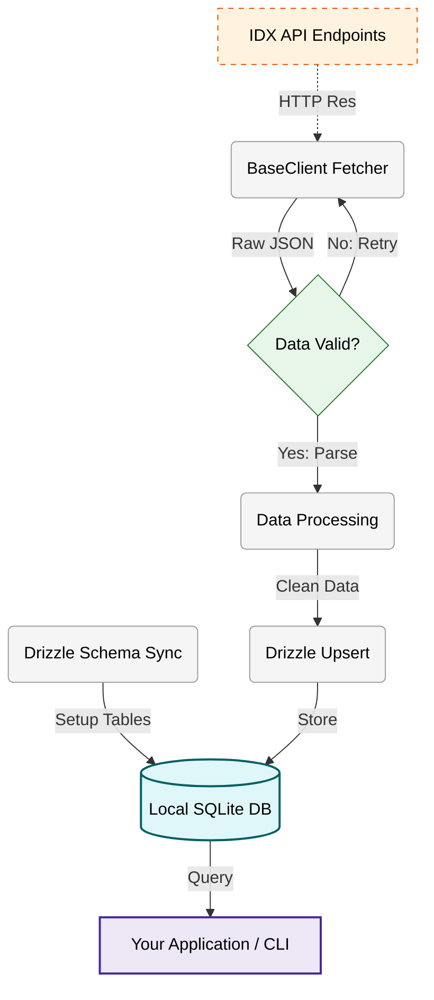

<div align="center">

# Indonesian Stock Exchange API Wrapper

A data pipeline for the Indonesian Stock Exchange (IDX). Built with Deno and Drizzle ORM to sync official market data into a structured SQLite database. It includes automated retries for network stability and provides modules for company info, indices, and trading data.

[](https://deno.com) [](https://www.sqlite.org/) [](https://orm.drizzle.team/)

[](https://github.com/NeaByteLab/IDX-API) [](LICENSE)

</div>

## Features

- **Automated Sync** - Scheduled data synchronization with retry logic
- **Official IDX Data** - Direct integration with Indonesian Stock Exchange APIs
- **Structured Storage** - SQLite database with Drizzle ORM for type-safe queries

## Installation

> [!NOTE]
> **Prerequisites:** For **Deno** (install from [deno.com](https://deno.com/)).

> [!TIP]
> **Want to see the data in action?** Check out [IDX-UI](https://github.com/NeaByteLab/IDX-UI) - the interactive dashboard for your market data!

**Clone Repository:**

```bash
# Clone the repository
git clone https://github.com/NeaByteLab/IDX-API.git

# Enter the project directory
cd IDX-API/

# Initialize the database (Drizzle generate & push)
deno task db:sync
```

**Requirements:**

- **[Deno](https://deno.com/)** (v2.5.0 or higher recommended)
- **Git** (for cloning the repository)

## Technology Stack

- **Runtime**: [Deno](https://deno.com/) (Modern, Secure, High-Performance)
- **Database**: [SQLite](https://www.sqlite.org/) via [LibSQL Client](https://github.com/tursodatabase/libsql-client-ts)
- **ORM**: [Drizzle ORM](https://orm.drizzle.team/) (Type-Safe SQL ORM)

## Architecture Overview



## Quick Start

```typescript
import * as sync from '@app/Backend/Sync/index.ts'
import IDXClient from '@app/index.ts'

// Initialize database (run once)
await sync.dbInitialize()

// Sync company profiles
await sync.syncCompanyProfile()

// Get current market data
const client = new IDXClient()
const indices = await client.market.getIndexList()
const stockSummary = await client.trading.getStockSummary('20240220')
```

For detailed usage examples, see [USAGE.md](USAGE.md).

## Module Overview

**Corporate Modules:**

- `syncCompanyProfile()` - Company metadata and profiles
- `syncCompanyAnnouncement()` - Corporate news and announcements
- `syncFinancialRatio()` - Financial indicators (PER, PBV, ROE, DER)
- `syncFinancialReport()` - Detailed financial reports
- `syncCompanyDividend()` - Dividend payment data
- `syncStockSplit()` - Stock split events
- `syncNewListing()` - IPO and new listings
- `syncCompanyDelisting()` - Delisted companies

**Market Modules:**

- `syncDailyIndex()` - Daily index performance
- `syncIndexList()` - Current index prices
- `syncIndexSummary()` - Daily index snapshots
- `syncForeignTrading()` - Foreign investor flows
- `syncTopGainer()` - Top gaining stocks
- `syncTopLoser()` - Top losing stocks

**Trading Modules:**

- `syncStockSummary()` - Daily OHLC and volume data
- `syncTradeSummary()` - Market aggregate data
- `syncBrokerSummary()` - Broker trading activity
- `syncTradingDaily()` - Real-time price snapshots
- `syncTradingSS()` - Historical trading data

**Participants Modules:**

- `syncBrokerParticipant()` - Exchange member brokers
- `syncDealerParticipant()` - Primary dealers
- `syncProfileParticipant()` - Participant profiles

**General Modules:**

- `syncMarketCalendar()` - Trading holidays and events
- `syncSecurityStock()` - Master security list

## Project Structure

```text
.
├── src/                  # Core modules and backend implementation
│   ├── Backend/          # Task automation, schemas, and sync logic
│   ├── Company/          # Corporate information endpoints
│   ├── Market/           # Market and index endpoints
│   ├── Participants/     # Broker and dealer endpoints
│   ├── Statistics/       # Stock activity endpoints
│   ├── Trading/          # Trading summary endpoints
│   └── Client.ts         # Main API client wrapper
├── tests/                # Deno unit test suites
├── sample/               # Generator for sample documentation
└── data/                 # SQLite database storage
```

## License

This project is licensed under the MIT license. See the [LICENSE](LICENSE) file for more info.
